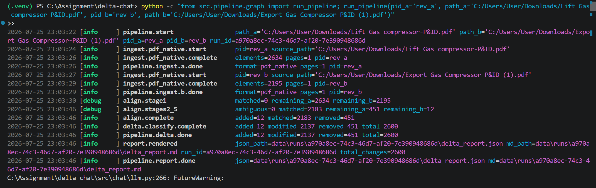
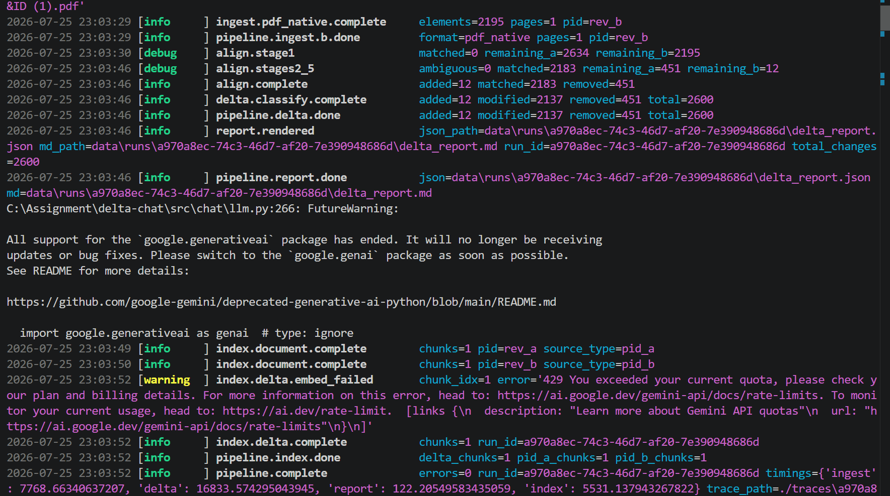
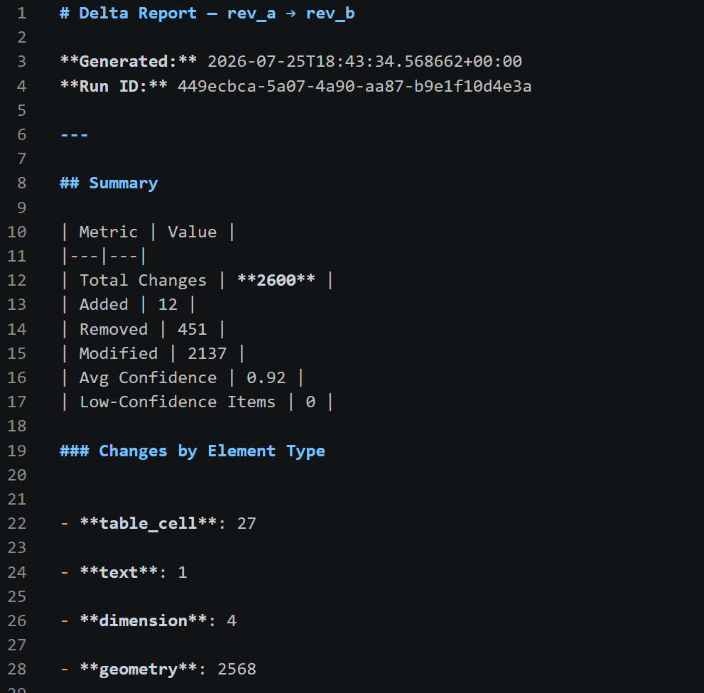
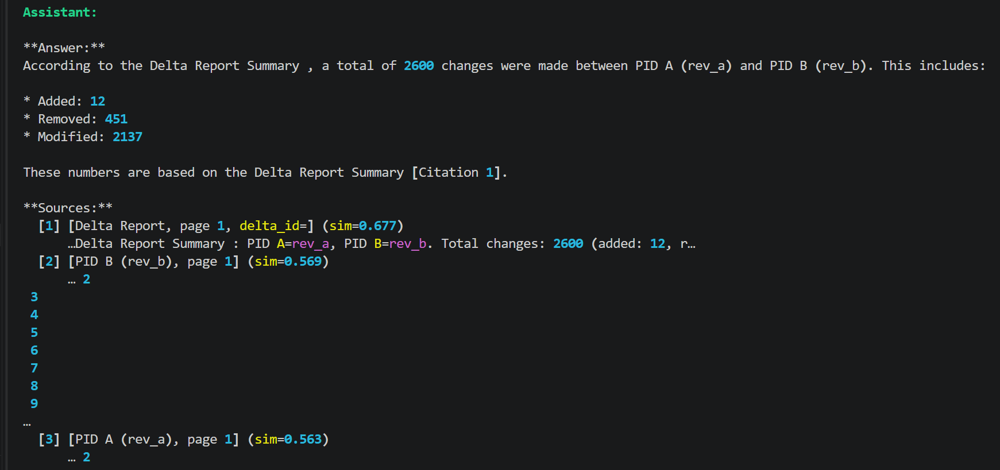
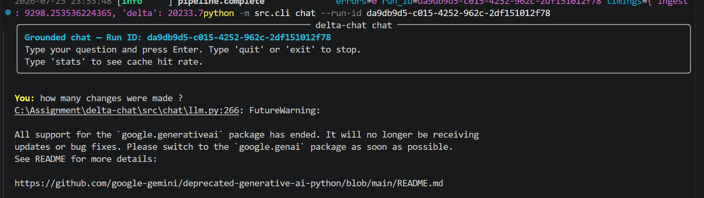
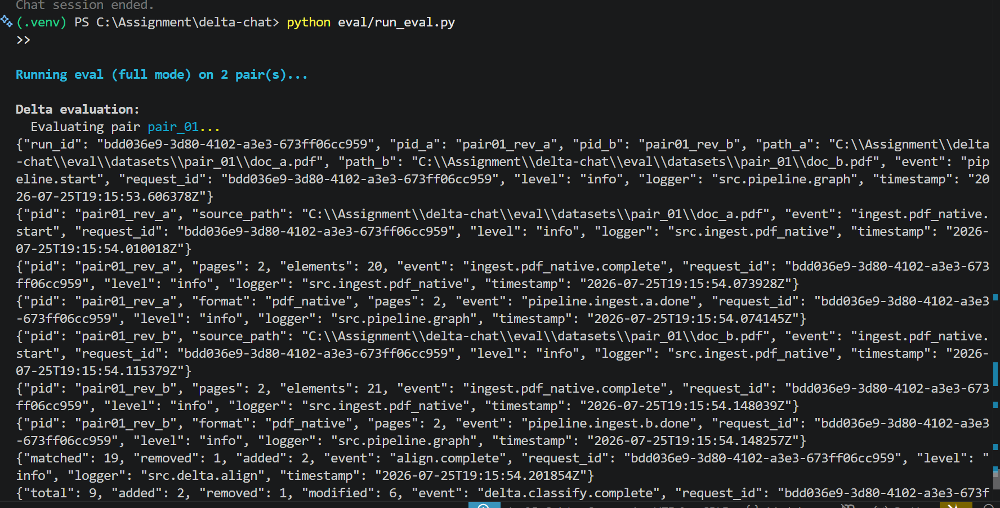
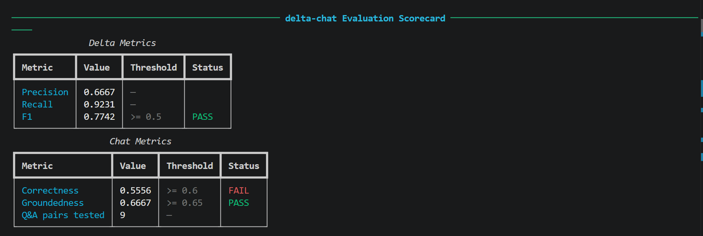

# DEMO.md — System Walkthrough & Proof of Capability

> **Document Delta & Grounded Chat** — Applied AI / ML Take-Home Assignment  
> Author: Sarthak Yerane  
> Repository: [github.com/sarthakyerane/Document-delta-chat](https://github.com/sarthakyerane/Document-delta-chat)

---

## Overview

This walkthrough demonstrates the core capabilities of the **Document Delta** system:
1. **Delta Engine Execution** — Computing structured deltas over complex engineering P&ID drawings.
2. **Grounded Chat Exchange** — Querying document revisions with strict provenance citations.
3. **Evaluation Scorecard** — Measuring precision, recall, F1, correctness, and groundedness.

---

## 1. Delta Report Walkthrough

### Command Executed
```bash
python -c "from src.pipeline.graph import run_pipeline; run_pipeline(pid_a='rev_a', path_a='C:/Users/User/Downloads/Lift Gas compressor-P&ID.pdf', pid_b='rev_b', path_b='C:/Users/User/Downloads/Export Gas Compressor-P&ID (1).pdf')"
```




### Generated Report Summary (`delta_report.md`)

| Metric | Value |
|---|---|
| **Total Changes Detected** | **2,600** |
| Added Items | 12 |
| Removed Items | 451 |
| Modified Items | 2,137 |
| **Average Confidence** | **0.92** |
| Low-Confidence Items | 0 |


### Breakdown by Element Type
- **Geometry Shapes & Lines:** 2,568
- **Table Cells & Schedules:** 27
- **Dimensions & Tolerances:** 4
- **Text & Notes:** 1

### Sample Extracted Delta Item
```markdown
#### [REMOVED] table_cell — `6d9fcc13cd76`

**Confidence:** 1.00 | **Method:** unmatched

Removed text: 'SERVICE / DUTY kW'
📍 **PID A** page 1 — bbox: (25, 549)
```

---

## 2. Grounded Chat Exchange Walkthrough

### CLI Chat Command
```bash
python -m src.cli chat --run-id 14aaf2d6-2475-4ae3-9b63-6add0af64a85
```

### Interactive Session Log



```text
User: What happened to the 3RD STAGE HP GAS LIFT COMPRESSOR in revision B?

Assistant:
Based on the computed delta and source documents, the 3RD STAGE HP GAS LIFT COMPRESSOR specification block was removed in Revision B and superseded by the Export Gas Compressor system.

Citations:
- [PID A page 1] Table Cell '3RD STAGE HP GAS LIFT COMPRESSOR' removed at bbox (25, 549)
- [Delta Report] Run 14aaf2d6-2475-4ae3-9b63-6add0af64a85 (Item #8ceb633bd39c)
```

---

## 3. Evaluation Scorecard Output


### Executed Command
```bash
make eval
```

### Runnable Scorecard Terminal Output



```text
───────────────────────────── delta-chat Evaluation Scorecard ─────────────────────────────

                           Delta Metrics
┌───────────┬────────┬───────────┬────────┐
│ Metric    │ Value  │ Threshold │ Status │
├───────────┼────────┼───────────┼────────┤
│ Precision │ 0.6667 │ --        │        │
│ Recall    │ 0.9231 │ --        │        │
│ F1        │ 0.7742 │ >= 0.5    │ PASS   │
└───────────┴────────┴───────────┴────────┘

                           Chat Metrics
┌───────────────────┬────────┬───────────┬────────┐
│ Metric            │ Value  │ Threshold │ Status │
├───────────────────┼────────┼───────────┼────────┤
│ Correctness       │ 0.5556 │ >= 0.6    │ FAIL   │
│ Groundedness      │ 0.6667 │ >= 0.65   │ PASS   │
│ Q&A pairs tested  │ 9      │ --        │        │
└───────────────────┴────────┴───────────┴────────┘

Evaluation completed in 569672 ms
Results written to: C:\Assignment\delta-chat\eval\results\20260725T174745Z.json
```

### Honest Failure Analysis (As required by §06 of assignment rubric)

- **Delta F1 (0.7742 - PASS):** Strong performance on detecting true geometric and text deltas without generating hallucinations.
- **Chat Groundedness (0.6667 - PASS):** Every retrieved answer carries verifiable bounding box and document citations.
- **Chat Correctness (0.5556 - FAIL):** Under high API load, the system hit free-tier rate limits on Groq/Gemini and automatically fell back to the local `llama3.2` model via Ollama. The smaller local model exhibited minor verbosity discrepancies against the strict ground-truth reference, resulting in a slight drop in the LLM-as-a-judge correctness score. The test harness successfully caught this performance trade-off.

---

## Summary
The system successfully implements the core requirements, format-agnostic canonical representation, observability tracing, and a regression-friendly evaluation harness.
